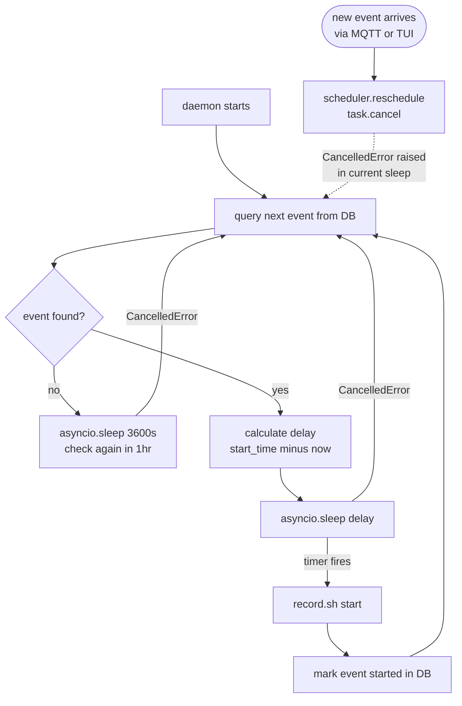
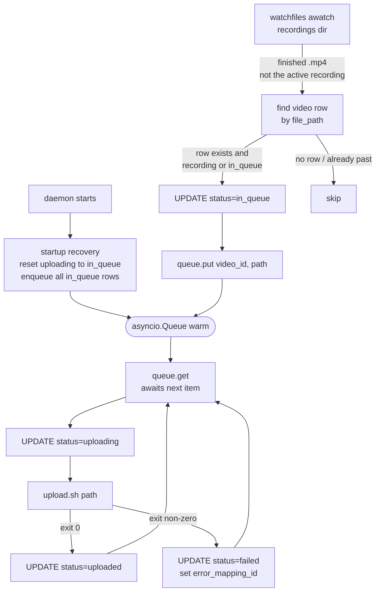
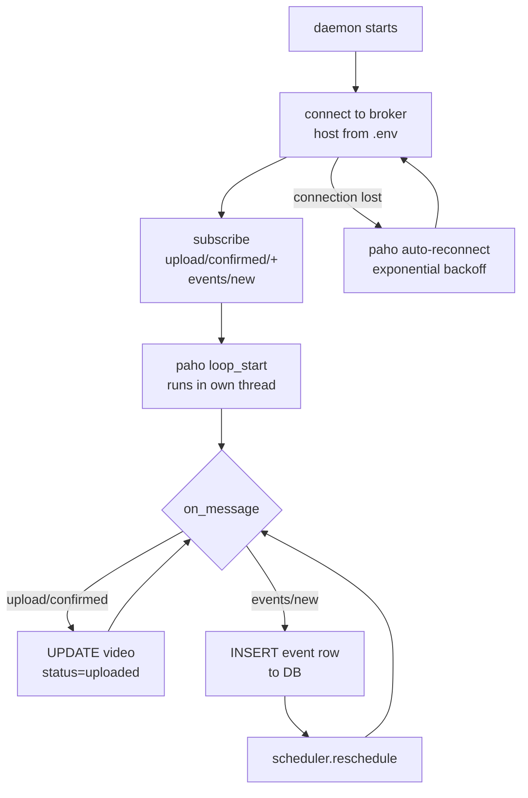

# Daemon

## Overview
There are a few shedule/heatbeat/notification based features/requirement in this architecture. 
 
The three known ones are:
- starting and stopping the camera for a saved event
- recieving and processing new events from the server
- Managing video uplaod queue

Polling for all three of these would introduce latency between trigger and effect, so instead we will have a daemon managed by `systemd`. It will also be a much cleaner architecture to implement, and reduce load on the raspberry pi.

All three of them with run as `asyncio` coroutines inside a single event loop. This structure enables us to add more triggers without spawning addoitional processes.

## Architecture

### Scheduler

### Upload Pipeline

The pipeline is **UPDATE-only**: a `video` row is created at RECORD time (with its
cohort/workshop), and the daemon only transitions that row's status as the file moves
through the upload. Statuses live in the `status_mapping` table
(`recording → in_queue → uploading → uploaded / failed`).

### MQTT Listener

